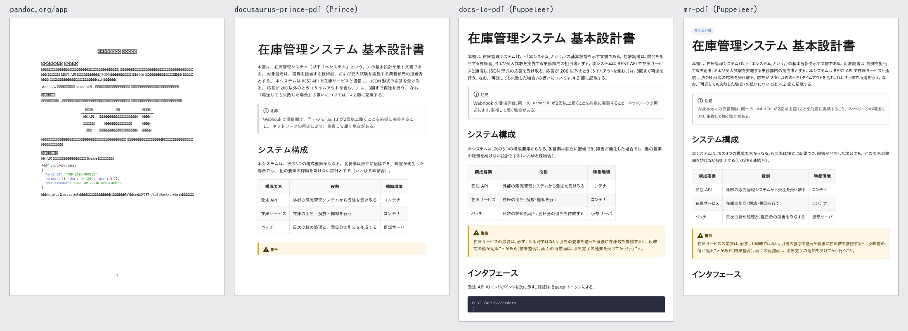

# 結果 — 既存ツールで同じ和文を PDF にした（2026-09-23）



同じ和文の設計書（`input/sample.md`）を、各ツールの**既定のまま** PDF にした。
PDF は `out/` にある。

## 結論

**豆腐になるのは pandoc.org/app だけ。** サイト系の3ツールは**読める PDF を出す。**
差があるのは「読めるか」ではなく「**文書になっているか**」のほう。

```
pandoc.org/app       和文が全部 □。UI から和文フォントを渡す手段が無い
サイト系の3ツール      読める。ただし「Web ページを印刷したもの」で、文書の体裁が無い
```

比較で主張できるのは次の点で、**「和文が読めない」「コピーできない」は主張できない。**

| | 既存ツールの実態 |
|---|---|
| ページ番号 | サイト系3つは**既定で無し** |
| 表紙・承認欄・改訂履歴 | どれにも無い（docs-to-pdf の表紙はタイトル1行） |
| 余白と行長 | docs-to-pdf は左右余白がほぼ無く、1行 45字前後 |
| 改ページ制御 | Prince は**警告の見出しだけがページ末に残る**。docs-to-pdf はコードが分断 |
| 和文の改行 | Prince と pandoc は**改行が空白になる**（「である。 対象読者」） |
| 透かし | Prince は1ページ目右上にロゴ |
| 動かすのに要るもの | サイト系は**サイトを立ち上げて巡回**する。Chromium か Prince が要る |
| 和文フォント | サイト系は**環境のフォント次第**。無いコンテナでは豆腐 |

---

## 1. ツールごとの結果

| | pandoc.org/app | docusaurus-prince-pdf | docs-to-pdf | mr-pdf |
|---|---|---|---|---|
| 版 | pandoc.wasm 3.11 | 1.2.1 + Prince 16.2 | 1.4.0 | 1.1.0 |
| 最終公開 | — | — | 2026-05 | **2022-05** |
| 所要時間 | 8.7 秒 | 4 秒 | 9 秒 | 10 秒 |
| ページ数 | 2 | 5 | 6 | 6 |
| 用紙 | Letter | Letter | **A4** | Letter |
| 和文フォント | **無し（豆腐）** | IPAゴシック | IPA Pゴシック | IPA Pゴシック |
| 文をコピーできる | はい | はい | はい | はい |
| admonition | **ただの段落に潰れる** | 枠とラベルあり | 枠とラベルあり | 枠とラベルあり |
| 表 | 罫線無し・中央寄せ | サイトの見た目 | サイトの見た目 | サイトの見た目 |
| ページ番号 | あり（素の数字） | **無し** | **無し** | **無し** |
| しおり | あり | あり | あり（見出しにゼロ幅空白が混入） | **無し** |
| 目次ページ | 無し | 無し | あり（見出しが英語） | あり（見出しが英語） |
| 透かし | 無し | **あり（ロゴ）** | 無し | 無し |

「文をコピーできる」は、`応答が 200 以外のとき（タイムアウトを含む。）は、3回まで再送を行う。`
を PDF から取り出して一致するかで見た（`scripts/inspect_pdf.py`）。

### 1.1 pandoc.org/app

- 和文が全部豆腐。埋め込みフォントは Libertinus Serif と DejaVu Sans Mono だけ
- **UI から和文フォントを渡す手段が無い。** フォントのアップロード欄はあるが、
  EPUB の「Embed fonts」用。PDF の経路は typst-assets のフォントしか読まない
- テキスト層には正しい文字が入っている（コピーはできる）。見た目だけが壊れている
- `:::note` は枠もラベルも無い段落になる
- 和文の改行が空白になる

### 1.2 docusaurus-prince-pdf（Prince）

- 見た目はサイトとほぼ同じ。admonition も表も出る
- **警告の見出しだけがページ末に取り残され、本文が次のページに行く**
- 改行が空白になる
- 1ページ目の右上に Prince のロゴ（無償版の透かし）
- **1.2.1 は Node 22 で起動しない**（`import ... assert` は Node 22 で廃止された構文）

### 1.3 docs-to-pdf（Puppeteer）

- 見た目はきれい。**和文の改行に空白が入らない**（Chromium が CJK 間の改行を除く）
- **左右余白がほぼ無い。** 1行 45字前後で、和文としては長い
- コードブロックがページ末で分断される
- 目次ページがあり、しおりもある。ただし**しおりの見出しにゼロ幅空白（U+200B）が混ざる**
  （Docusaurus の見出しアンカーが漏れている）
- 目次ページの見出しは英語の「Table of contents:」

### 1.4 mr-pdf

- 2022-05 から更新が止まっているが、動く。出力は docs-to-pdf とほぼ同じ
- **しおりが無い**（目次ページはある）
- 1ページ目が白紙

---

## 2. 事前の想定と違ったこと

**「Puppeteer 系はテキストを正しくコピーできない、目次が無い」は、少なくともいまは当たらない。**
docs-to-pdf も mr-pdf も、和文をそのままコピーできた。docs-to-pdf はしおりも付く。
比較の材料として使うなら、この2点は外す。

**サイト系の和文は、ツールではなく環境のフォントで決まる。** ここでは IPAゴシック が
あったので読めた。和文フォントの無いコンテナ（CI や Docker）では豆腐になり、
docusaurus-prince-pdf の README もフォントのマウントを案内している。

---

## 3. やらなかったこと

- **Excel 関連の2項目**（AI にスクリプトを書かせる / Claude の Excel 生成機能）は今回は行わない判断
- **Google Docs** は手作業。手順と評価表は `manual/README.md`（未実施）
